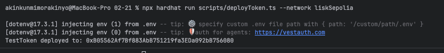

# Sample Hardhat Project

This project demonstrates a basic Hardhat use case. It comes with a sample contract, a test for that contract, and a Hardhat Ignition module that deploys that contract.

Try running some of the following tasks:

```shell
npx hardhat help
npx hardhat test
REPORT_GAS=true npx hardhat test
npx hardhat node
npx hardhat ignition deploy ./ignition/modules/Lock.ts
```


TestToken deployed to: 0xB05562Af7Bf883AbB751219fa3EDa092bB756080



SchoolManagement deployed to: 0xe080AE5024D981b5E51ceF9870213AaF057e408a


npx hardhat verify \
--network liskSepolia \
0xe080AE5024D981b5E51ceF9870213AaF057e408a \
0xB05562Af7Bf883AbB751219fa3EDa092bB756080 \
1e18 \
2e18 \
3e18 \
4e18
