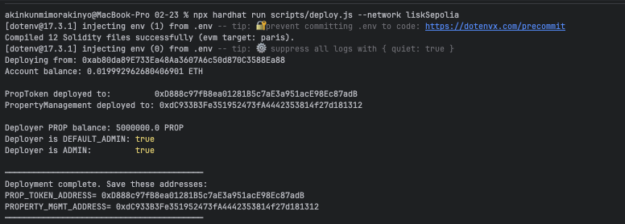

# Sample Hardhat Project

This project demonstrates a basic Hardhat use case. It comes with a sample contract, a test for that contract, and a Hardhat Ignition module that deploys that contract.

Try running some of the following tasks:

```shell
npx hardhat help
npx hardhat test
REPORT_GAS=true npx hardhat test
npx hardhat node
npx hardhat ignition deploy ./ignition/modules/Lock.ts
```



Deploying from: 0xab80da89E733Ea48Aa3607A6c50d870C3588Ea88
Account balance: 0.019992962680406901 ETH

PropToken deployed to:         0xD888c97fB8ea01281B5c7aE3a951acE98Ec87adB
PropertyManagement deployed to: 0xdC933B3Fe351952473fA4442353814f27d181312

Deployer PROP balance: 5000000.0 PROP
Deployer is DEFAULT_ADMIN: true
Deployer is ADMIN:         true

─────────────────────────────────────────
Deployment complete. Save these addresses:
PROP_TOKEN_ADDRESS= 0xD888c97fB8ea01281B5c7aE3a951acE98Ec87adB
PROPERTY_MGMT_ADDRESS= 0xdC933B3Fe351952473fA4442353814f27d181312